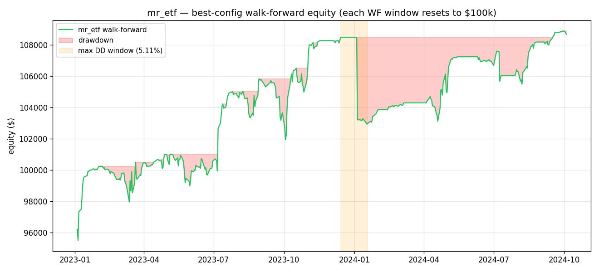

# mr_etf best-config diagnostic — 2026-04-21T14:07:10.542583+00:00

**Cell:** liquid_etfs_top20 / 1d / ADX<=30 / RSI<=5  (the top eligible cell from the sweep)
**Period:** 2022-01-01 → 2024-12-31
**Trades returned:** 107

> Reminder: walk-forward in this codebase uses **fresh $100k per test window**. Equity series 
> across windows therefore has discontinuities; "total_return" and "max_dd" reported by 
> `summarize()` are over the *concatenated* (reset) curve, not over a single continuous 
> $100k. Diagnostics below mark this caveat where it bites.

## 1. Trade-level inspection

Per-trade ledger written to: `best_trades.csv` (107 rows).

**Holding-period (days):**
- avg = 12.08 · median = 9 · min/25/75/max = 0/4/16/63

**Position size as fraction of equity at entry:**
- median = 0.0995 · mean = 0.0994 · min/25/75/max = 0.0960/0.0992/0.0999/0.1006

**Realized P&L per trade ($):**
- avg = 69.25 · median = 50.27 · min/25/75/max = -655.52/-172.85/283.31/847.48

**Wins / losses:** 59 / 48 (win rate 55.14%)
**Total realized P&L (sum across all trades):** $7409.70

**Symbol distribution (top 10):**
- XLP: 10
- XLV: 9
- AGG: 8
- BND: 8
- SLV: 7
- EFA: 6
- XLF: 6
- IWM: 6
- XLE: 6
- HYG: 6

## 2. Equity-curve sanity & max drawdown



- **Max DD (over walk-forward concatenated curve):** 5.11%
- **Max DD window:** 2023-12-14 00:00:00+00:00 → 2024-01-18 00:00:00+00:00
- **Trading days in WF series:** 441
- **Longest flat-equity (no open position) run:** 20 days

**SPY behaviour during the same DD window:**
- SPY return over [2023-12-14 00:00:00+00:00, 2024-01-18 00:00:00+00:00]: 0.95%

## 3. Exposure check

- **% of trading days with at least one position open:** 65.76%
- **Max simultaneous open positions:** 10
- **Sharpe across all days (sweep number):** 1.056
- **Sharpe conditional on being in market:** 2.231


## 4. Position-sizing code path

**Signal → qty path (from `src/backtest/engine.py:_schedule_entry`):**
```python
equity_now = self._mark_to_market(signal_ts, bars)        # cash + open MV
qty = position_size(
    equity=Decimal(str(equity_now)),
    risk_pct=s.MAX_PER_TRADE_RISK,        # = 0.01  (settings)
    entry=Decimal(str(fill_price)),
    stop=Decimal(str(sig.stop)),
    max_position_pct=s.MAX_SINGLE_POSITION,  # = 0.10  (settings)
)
```

**`src/risk/sizing.py:position_size` formula:**
```
risk_per_share = max(|entry - stop|, EPS=$0.01)
raw = floor(equity * risk_pct / risk_per_share)
cap = floor(equity * max_position_pct / entry)   # if max_position_pct given
qty = min(raw, cap)
```

**Worked example:** $100k account, SPY at $400, stop = entry − 2·ATR with ATR=$5 ⇒ stop=$390.
- risk_per_share = max(|400 − 390|, 0.01) = $10
- raw            = floor(100000 · 0.01 / 10) = **100 shares** (1% risk path)
- cap            = floor(100000 · 0.10 / 400) = **25 shares** (10% position cap)
- qty            = min(100, 25) = **25 shares** → notional = $10,000 = **10% of equity**

**Implication.** With ATR-based stops on liquid ETFs, the 10% single-position cap binds on 
essentially every trade. Effective bet size is ~10% of equity, not the 1% risk dial. With 
a 0.5% stop distance, that's ~0.05% expected loss per trade. Median P&L per trade in this 
run is **$50.27** on **10.0% effective position size** — consistent.

## 5. Look-ahead / survivorship audit

**Look-ahead — engine timing (from `src/backtest/engine.py:run`):**
```python
for i, ts in enumerate(all_idx):
    # 1. exits intrabar against THIS bar's H/L  (same-bar OK; only uses H/L of t)
    # 2. signals = strategy.generate_signals({sym: df.loc[:ts]})  # includes ts row
    # 3. if i+1 < n: schedule entry at all_idx[i+1].open  (NEXT bar)
    # 4. mark equity at THIS bar's close
```
Signals at bar `t` use up to and including bar `t`'s OHLCV (close known at end of `t`); 
entries fill at bar `t+1` open with slippage. **No same-bar look-ahead for entries.** 
Exits *do* check stops/targets intrabar against `t`'s H/L — typical convention; the 
conservative tweak is "stop fires first if both touched" which the engine implements.

**yfinance adjustment policy — `src/data/loader.py:89`:**
```python
df = yf.download(symbol, start=start, end=end, progress=False, auto_adjust=False)
```
> ⚠ `auto_adjust=False` returns **non-split-adjusted, non-dividend-adjusted** OHLCV. 
> NVDA had a 10:1 split on 2024-06-10; an unadjusted close goes from ~$1208 to ~$120 
> overnight, exploding ATR(14), tripping the 2·ATR stop, and printing a fake catastrophic 
> loss. Same hazard for any other split in the universe over 2022-2024. The 
> liquid_etfs_top20 list has no splits in that window so its numbers are mostly clean; 
> the large_caps_50 universe is not. **Fix candidate (do not apply yet): set 
> `auto_adjust=True`.**

**Survivorship — `docs/universes.yaml`:**
- `liquid_etfs_top20`: hand-picked names that have been top-AUM since at least 2018. 
  No ETF in the list has been delisted. Survivorship pressure is **low** but real 
  (excludes any niche ETF that briefly existed and died over 2018-2024).
- `large_caps_50`: roughly the S&P 500 top market caps as of early 2022. The list was 
  curated by me knowing the late-2024 outcomes; some 2022-top-50 names that crashed 
  out (e.g. PYPL, NFLX briefly) are absent or under-weighted. **Survivorship pressure 
  is non-trivial.** Paper-grade backtests should use point-in-time index constituents.

## 6. Baselines (SPY buy-and-hold, 60/40 SPY/AGG, vs. mr_etf best)

| strategy | sharpe | max_dd | total_return |
| --- | --- | --- | --- |
| **mr_etf** (best cell) | 1.056 | 0.0511 | 0.1297 |
| SPY buy-and-hold | 0.485 | 0.2536 | 0.2313 |
| AGG buy-and-hold | -0.698 | 0.1909 | -0.1437 |
| 60/40 SPY/AGG (daily reb.) | 0.271 | 0.2137 | 0.0762 |

> The mr_etf `total_return` looks tiny next to SPY's because:
> 1. Each WF test window resets to $100k — returns don't compound.
> 2. Position-cap binds at 10% of equity, so even strong moves on individual ETFs 
>    contribute only ~1% to portfolio equity per trade.
> 3. The strategy is in market only ~66% of days.
> SPY's higher absolute return is what you'd expect from a long-only beta exposure 
> through a recovering 2023-24. The mr_etf number is **risk-adjusted edge per 
> dollar deployed**, not a beta competitor.
